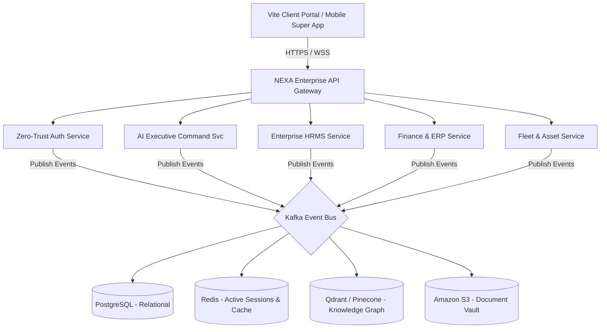
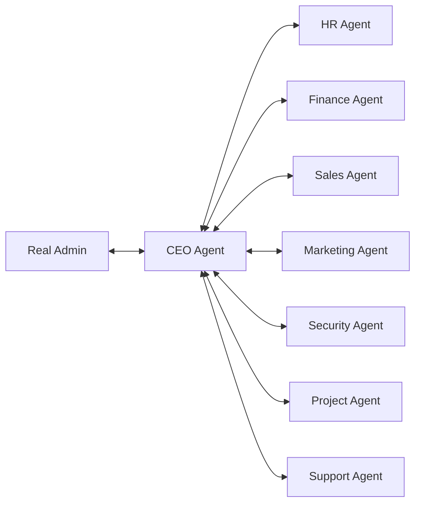

# 🚀 NEXA Enterprise X (Autonomous Enterprise OS)
### Architectural Roadmap & Next-Generation Specifications

This document outlines the advanced, production-grade vision and system blueprints to scale the **NEXA Growth Platform** from a management portal into a fully autonomous, next-generation **AI-First Enterprise Operating System (Enterprise OS)**.

---



---

## 1. AI Executive Command Center

Transform the dashboard from a static reporting interface into a proactive, data-driven **AI Chief Operating Officer (AI COO)**.

### A. Core Intelligence Modules
*   **AI Business Health Score (0-100)**: Evaluates real-time health across five dimensions: Financial Liquidity, Team Velocity, Project Churn Risk, Lead pipeline density, and System Security threats.
*   **Predictive Revenue Engine (30/60/90 Days)**: Analyzes historical invoice settlement schedules, active contracts, and sales pipelines using statistical linear regressions and sequence predictions to forecast corporate cash-flow.
*   **Employee Productivity Prediction**: Aggregates timesheet velocity, task completeness ratings, and check-in consistency to alert HR of potential burnout or low engagement levels before milestones slip.
*   **Client Churn Prevention Matrix**: Continuously scans client portals and communications to identify flags (e.g., tickets remaining open, inactivity thresholds, drop in platform visits) and calculates risk probabilities.

### B. Executive Reporting & Alerts

> [!WARNING]
> **Proactive Churn Alert**: Client *XYZ Logistics* has registered a **72% churn probability** due to 45 days of project inactivity. Recommended action: Auto-schedule check-in briefing and dispatch updated service proposal within 7 days.

---

## 2. Autonomous Multi-Agent Network

Instead of a monolithic single-agent module, deploy a network of specialized, collaborative **Autonomous AI Agents** communicating via an internal event loop:



### Agency Roles & Responsibilities

| Specialist Agent | Core Area | Autonomous Capability |
| :--- | :--- | :--- |
| **CEO Agent** | Strategic Oversight | Analyzes business health score, drafts quarterly budget plans, and alerts of systemic operational bottlenecks. |
| **HR Agent** | Hiring & Onboarding | Screens resumes from inbound mails, schedules interviews on calendars, and automates employee checklist sign-offs. |
| **Finance Agent** | Ledger & Accounting | Generates invoices, checks expense logs against budgets, flags tax variances, and executes automated payroll runs. |
| **Sales Agent** | Lead Generation | Scrapes directories, qualifies opportunities based on budget/complexity models, and schedules connection follow-ups. |
| **Marketing Agent** | Brand Content | Generates search-optimized content, tracks post analytics, and schedules multi-channel updates. |
| **Security Agent** | Threat Monitoring | Monitors login locations, flags anomalous data access, and triggers lockdown events if breaches occur. |
| **Project Agent** | Task Dispatcher | Breaks down deliverables into sub-tasks, assigns specialists dynamically based on velocity, and flags delayed tasks. |
| **Support Agent** | Client Support | Resolves incoming tickets, explains technical milestones, and elevates complex bugs to senior developers. |

---

## 3. Knowledge Graph Engine (Company Intelligence Graph)

Create a highly integrated, company-wide semantic model representing the interconnected layers of your enterprise operations:

```
  [Employee] ──(Assigned To)──► [Task] ──(Part Of)──► [Project]
       │                                                 │
  (Compensated)                                     (Delivered To)
       ▼                                                 ▼
   [Salary]                                           [Client] ──(Settles)──► [Revenue]
```

*   **Semantic Indexing**: Convert all projects, emails, task briefs, and chats into vector embeddings using `text-embedding-3-small`.
*   **Vector Database (Qdrant / Pinecone)**: Perform real-time relation lookups, context-aware semantic searches, and dynamic recommendation generations across operations.

---

## 4. Zero Trust Security Shield

Transition authentication and session protocols to a strict **Zero Trust Architecture**.

*   **Multi-Factor & Biometric Auth**: Integrate device-level Biometrics (Windows Hello / Apple FaceID) via WebAuthn, paired with standard SMS/OTP.
*   **Geo-Fencing & Anomalous Action Detection**: Trigger verification checks if access is requested outside defined IP blocks or if credentials originate from unexpected geographic coordinates.
*   **Security Command Center Dashboard**:
    1.  **Emergency System Lockdown**: Instantly revokes active session tokens, suspends API routes, and locks database pools during active threats.
    2.  **Database Recovery Center**: Automates daily encrypted backups, maintains point-in-time recovery configurations, and restores database replicas with single-click command sequences.

---

## 5. Enterprise ERP, HRMS & Workflow Automation

### A. Advanced HRMS
*   **Recruitment Pipeline**: Captures applications, screens candidates using AI criteria, and handles virtual coding evaluations.
*   **Lifecycle Tracker**: Tracks employee progression from contract signing, promotion steps, skill gap metrics, up to final offboarding audits.
*   **OKR (Objectives and Key Results)**: Aligns company key results to specific project progress indicators automatically.

### B. Accounting ERP
*   **Invoice & Cash Flow Management**: Automated monthly invoices with multi-currency support, GST tracking, and real-time cash flow forecasting models.
*   **Vendor Ledger**: Tracks supplier contracts, automates payouts, and categorizes company operating expenses.

### C. Workflow Automation Engine
Create visual pipelines similar to n8n directly in the dashboard interface to manage automated lead actions:

```
[New Scraped Lead]
       │
       ▼
[AI Score Check] ────(Opportunity Score < 75)────► [Archive Lead]
       │
 (Opportunity Score >= 75)
       ▼
[Generate Custom Proposal]
       │
       ▼
[Auto-Dispatch Email Outreach]
       │
       ▼
[Create CRM Pipeline Deal] ──► [Schedule Follow-up Task in 3 Days]
```

---

## 6. Mobile Super App (Capacitor Hybrid Wrapper)

Allows the team to operate on-the-go with native mobile app utilities for both **Android** and **iOS**:

*   **Geo-Fenced Clock-In/Out**: Utilizes device GPS signals to verify that physical check-in locations match project worksites or office regions.
*   **QR Scanner Console**: Instantly records office or field attendance by scanning dynamic terminals.
*   **AI Mobile Voice Assistant**: Direct voice-to-text querying of project summaries, metrics, and timesheet logs.

---

## 7. Fleet & Asset Management (Crane Logistics Integration)

Especially tailored for companies managing heavy machinery, vehicles, or crane operations:

*   **Telemetry & GPS Tracking**: Real-time asset location coordinates, vehicle speed metrics, and geographical boundary fencing (Geofencing alerts).
*   **Preventative Maintenance Logs**: AI-based wear-and-tear calculations using machine hours to schedule parts replacements before failure.
*   **Logistics Route Optimization**: Dynamically plans routing maps for heavy transport based on cargo constraints, traffic indices, and road clearances.

---

## 8. Enterprise Architecture & Tech Stack

```
                              ┌───────────────────────────┐
                              │     Vite React Client     │
                              └─────────────┬─────────────┘
                                            │ (HTTPS / WSS)
                              ┌─────────────▼─────────────┐
                              │    API Gateway (Kong)     │
                              └─────────────┬─────────────┘
                                            │
         ┌──────────────────────────┬───────┴──────────┬─────────────────────────┐
         ▼                          ▼                  ▼                         ▼
┌─────────────────┐       ┌──────────────────┐ ┌────────────────┐       ┌─────────────────┐
│  Auth Service   │       │  Executive AI    │ │  HRMS Service  │       │  Finance ERP    │
└────────┬────────┘       └─────────┬────────┘ └───────┬────────┘       └────────┬────────┘
         │                          │                  │                         │
         └──────────────────────────┼───────┬──────────┴─────────────────────────┘
                                    │
                                    ▼
                        ┌───────────────────────┐
                        │   Kafka Event Bus     │
                        └───────────┬───────────┘
                                    │
         ┌──────────────────────────┼──────────────────┬─────────────────────────┐
         ▼                          ▼                  ▼                         ▼
┌─────────────────┐       ┌──────────────────┐ ┌────────────────┐       ┌─────────────────┐
│   PostgreSQL    │       │   Redis Cache    │ │   Qdrant DB    │       │    S3 Storage   │
│ (Core Relational)│      │  (Active Session)│ │ (Vector Graph) │       │ (Doc / Assets)  │
└─────────────────┘       └──────────────────┘ └────────────────┘       └─────────────────┘
```

### Key Infrastructure Targets

> [!NOTE]
> *   **Message Broker**: **Apache Kafka** decouples service endpoints and runs asynchronous tasks (like AI generations, PDF rendering, email dispatches, and log recording) without slowing the client app interface.
> *   **In-Memory Store**: **Redis** caches active auth sessions, API configurations, and analytics logs to keep page loads under `10ms`.
> *   **Scalability Layer**: Deploy all microservice clusters on **Kubernetes (K8s)** to support auto-scaling during peak usage.
