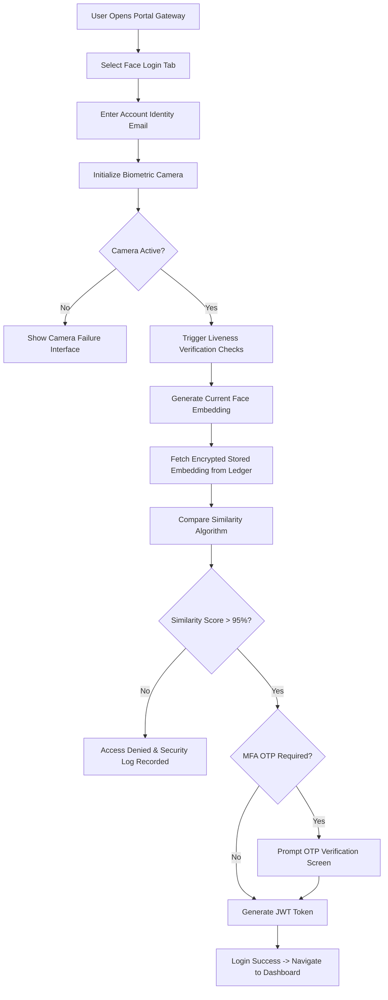

# NexovTech Face Authentication Specification

## Overview
Enterprise-grade facial recognition system integrated into the NexovTech Management platform. This document defines the menu structure, enrollment flow, backend database schema, API contracts, verification logic, security policies, and anti-spoofing countermeasures.

---

## ⚙️ Settings → Security → Face Authentication

### Menu Structure
```
Settings
 ├─ Profile
 ├─ Security
 │   ├─ Change Password
 │   ├─ Two-Factor Authentication
 │   ├─ Trusted Devices
 │   └─ Face Authentication
 ├─ Notifications
 └─ Preferences
```

### Face Authentication Page Layout
Designed to match premium enterprise dashboards with a sleek glassmorphic HUD.

#### 1. Status Card
* **Title**: Face Authentication
* **Status**: `Not Enrolled` | `Enrolled`
* **Description**: Protect your account using facial recognition.
* **Actions**: `[ Enroll Face ]` (when not enrolled) | `[ Re-Enroll Face ]` & `[ Delete Face Data ]` (when enrolled)

#### 2. Additional Settings (Toggles)
* **Enable Face Login**: Toggle to enable/disable passwordless login bypass.
* **Require Face + OTP**: Multi-factor override requiring face match followed by email-based/MFA OTP.
* **Trusted Device Mode**: Restricts face login to only previously catalogued/trusted devices.
* **Login Notifications**: Dispatches Telegram/Email security node alerts for every successful or failed face login attempt.

---

## 🔄 Lifecycle Flows

### 1. Enrollment Flow
```mermaid
graph TD
    A[User Logged In] --> B[Navigate to Settings]
    B --> C[Select Security -> Face Authentication]
    C --> D[Click Enroll Face]
    D --> E[Verify Current Password/OTP]
    E --> F[Grant Camera Permission]
    F --> G{Face Detected?}
    G -- No --> H[Show Framing Error]
    G -- Yes --> I[Capture Multiple Angles]
    I --> J[Perform Liveness Challenges]
    J --> K[Generate Face Embedding]
    K --> L[Encrypt Embedding (AES-256)]
    L --> M[Save to Ledger Database]
    M --> N[Enable Face Authentication]
    N --> O[Success Status Card Displayed]
```

### 2. Login Flow (Authentication)


---

## 🛡️ Anti-Spoofing & Liveness Countermeasures
To prevent photo/video presentation attacks (spoofing), the verification challenge progresses through active liveness tests.

```
Face Detected
      ↓
Stage 1: Center Face (Active Frame Bounds Check)
      ↓
Stage 2: Blink Detection (Challenge: Blink twice slowly)
      ↓
Stage 3: Head Turn Left (Angular facial mapping)
      ↓
Stage 4: Head Turn Right (Angular facial mapping)
      ↓
Stage 5: Smile Verification (Dynamic muscle distortion) [Optional]
      ↓
Success Validation
```

* **Failed Checks**: Any challenge timeouts or anomalies terminate the scanner sequence immediately, recording a `Failed_Liveness` event in the ledger database and dispatching alert notifications if configured.

---

## 💾 Database Schema

### User Document Updates
Existing `users` collection updated with settings flags:
```json
{
  "face_auth_enabled": true,
  "face_enrolled_at": "2026-06-15T18:00:00.000Z",
  "last_face_login": "2026-06-15T18:05:00.000Z",
  "face_auth_status": "enrolled",
  "face_auth_settings": {
    "requireOtp": false,
    "trustedDeviceMode": false,
    "loginNotifications": true
  }
}
```

### Biometric Ledger Table
Stored in `biometrics_templates` collection:
```json
{
  "id": "biometric_node_id",
  "userId": "user_id_ref",
  "email": "user.email@nexovtech.com",
  "encryptedTemplate": "aes_256_encrypted_embedding_hash",
  "tenantId": "org_default",
  "createdAt": "2026-06-15T18:00:00.000Z"
}
```

---

## 🔌 API Route Specifications

### 1. Enroll Profile
* **Route**: `POST /api/security/biometrics/enroll`
* **Headers**: `Authorization: Bearer <JWT_TOKEN>`
* **Payload**:
```json
{
  "userId": "user_id",
  "email": "user@nexovtech.com",
  "biometricTemplate": "template_hash",
  "consent": true,
  "settings": {
    "requireOtp": false,
    "trustedDeviceMode": false,
    "loginNotifications": true
  }
}
```

### 2. Verify / Login
* **Route**: `POST /api/security/biometrics/verify`
* **Payload**:
```json
{
  "email": "user@nexovtech.com",
  "biometricTemplate": "template_hash",
  "deviceId": "device_fingerprint_id",
  "deviceInfo": {
    "platform": "Windows",
    "browser": "Chrome"
  },
  "livenessPassed": true,
  "otpToken": "123456"
}
```

---

## 🏗️ NexovTech Architecture Recommendation
1. **Frontend**: Next.js/React Interface with HTML5 Canvas parsing + browser-native MediaDevices.
2. **Detection Logic**: MediaPipe Face Mesh & Face-api.js for active landmarks, blink detection, and yaw/pitch tracking.
3. **Backend Service**: Node.js/Express Server with JWT validation.
4. **Data Security**: AES-256 encryption on templates before DB insertion.
5. **Database**: PostgreSQL (Production) / Firebase Firestore or JSON Local Vault (Fallback).
